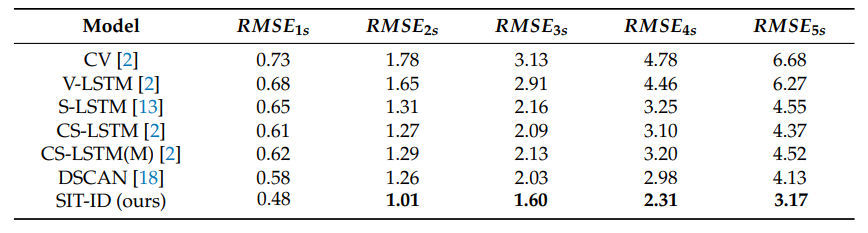

# AICAS - Artificially Intelligent Collision Avoidance System 

Official repository of AICAS


## Installation
### Install Anaconda
We recommend using Anaconda.
The installation is described on the following page:\
https://docs.anaconda.com/anaconda/install/linux/

### Install Required Packages
```sh
conda create --name myenv --file env-spec.txt
```

### Activate Environment
```sh
conda activate myenv
```

## Walkthrough

- GCN.py contains the Graph Convolution Network for self-intention prediction.
- models.py contains the Neighbour Trajectory Prediction model
- feeder.py contains code to preprocess Brain4Cars, BLVD and NGSIM dataset
- main.py contains the script to train-val-test Neighbour Trajectory Prediction (currently implementation script for GCN not ready yet)

## RMSE Results

The trajectory prediction model's state-of-the-art performance




